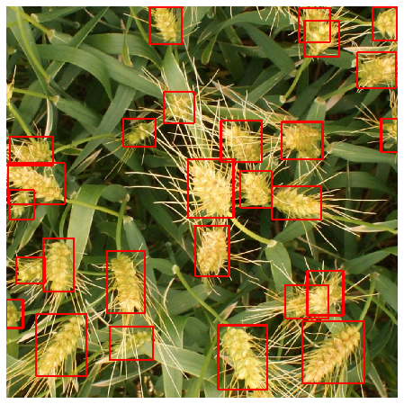
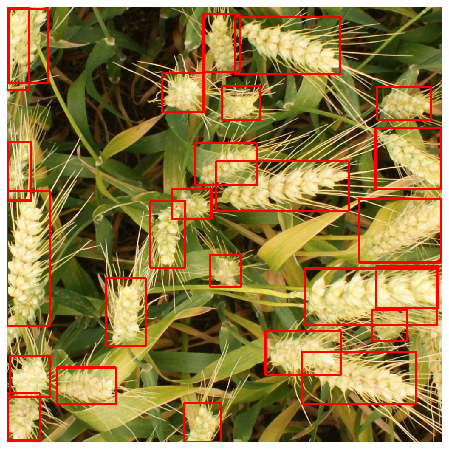

# [Global-Wheat-Detection](https://www.kaggle.com/c/global-wheat-detection)

The challenge in this Kaggle competition is to detect the wheat heads and draw bounding boxes around all the detected wheat heads in the given image. Here are a few example of the predictions generated using FasterRCNN model:

  
   
  

Here are a few approaches I tried to approach the problem with brief description and achieved score on public leader board (score is mAP (mean average precision) in this competitions).

## Experiment #1 (0.6426 on public LB)
- Used model: COCO Pre-trained FasterRCNN with ResNet50 backbone
- No image augmentations
- Other settings:
  - Image size:1024 x 1024
  - No CV
  - 5 Epochs
  - Batch size: 16 images
  
## Experiment #2 (0.6547 on public LB)
- Used model: COCO Pre-trained FasterRCNN with ResNet50 backbone
- No image augmentations
- 1 round of training on pseudo Labels
- 5 epochs to train on original data, 4 epochs for training on pseudo labels

 ## Experiment #3 (0.6575 on public LB)
- Used model: COCO Pre-trained FasterRCNN with ResNet50 backbone
- No image augmentations
- 2 rounds of training on pseudo Labels
- 5 epochs to train on original data, 4 epochs/round for training on pseudo labels

 ## Experiment #4 (0.6528 on public LB)
- Used model: COCO Pre-trained FasterRCNN with ResNet50 backbone
- No image augmentations
- 3 rounds of training on pseudo Labels
- 5 epochs to train on original data, 4 epochs/round for training on pseudo labels

 ## Experiment #5 (0.6498 on public LB)
- Used model: COCO Pre-trained FasterRCNN with ResNet50 backbone
- Random Brightness, Contrass, Horizontal and Vertical flips and Hue Saturation Value Image Augmentations
- No pseudo labels
- 12 epochs on augmented dataset: https://www.kaggle.com/kaushal2896/gwdaugmented/version/3

 ## Experiment #6 (0.6826 on public LB)
- Used model: COCO Pre-trained FasterRCNN with ResNet50 backbone
- Random Brightness, Contrass, Horizontal and Vertical flips and Hue Saturation Value Image Augmentations
- 2 rounds of psuedo labeling
- 12 epochs on augmented dataset (mentioned on exp #5) and 4 epochs/round for training on pseudo labels

 ## Experiment #7 (0.6582 on public LB)
- Used model: COCO Pre-trained FasterRCNN with ResNet50 backbone
- Random Brightness, Contrass, Horizontal and Vertical flips, Hue Saturation Value Image Augmentations and Random Cutout (with handling of bounding boxes)
- No pseudo labeling
- 20 epochs on augmented dataset: https://www.kaggle.com/kaushal2896/gwdaugmented/version/4

 ## Experiment #8 (0.6624 on public LB)
- Used model: COCO Pre-trained FasterRCNN with ResNet101 backbone
- Random Brightness, Contrass, Horizontal and Vertical flips, Hue Saturation Value Image Augmentations
- No pseudo labeling
- 5 epochs on augmented dataset: https://www.kaggle.com/toomuchdataerror/resnet101trainedmodel

## Experiment #9 (0.6817 on public LB)
- Ensemble of Exp. #8 and Exp. #7
- Used WBF (Weighted Boxes Fusion) as an ensemble technique.

## Experiment #10 (0.6824 on public LB)
- Used model: COCO Pre-trained FasterRCNN with ResNet101 backbone
- Random Brightness, Contrass, Horizontal and Vertical flips, Hue Saturation Value Image Augmentations
- 5-fold Cross Validation with WBF ensemble
- 5 epochs per fold

## Experiment #11 (0.6910 on public LB)
- Used model: COCO Pre-trained FasterRCNN with ResNet101 backbone
- Horizontal and Vertical flips, Only one of Random Brightness Contrass or Hue Saturation Value Image Augmentations
- 5-fold Cross Validation with WBF ensemble
- 20 epochs per fold

## Experiment #12 (0.6859 on public LB)
- Used model: Pretrained EfficientDet D5
- Horizontal and Vertical flips, Only one of Random Brightness Contrass or Hue Saturation Value Image Augmentations
- No CV
- 3 epochs

## Experiment #13 (0.7147 on public LB)
- Used model: Pretrained EfficientDet D5
- Horizontal and Vertical flips, Only one of Random Brightness Contrass or Hue Saturation Value Image Augmentations
- No CV
- 20 epochs

## Experiment #14 (0.7194 on public LB)
- Used model: Pretrained EfficientDet D5
- Horizontal and Vertical flips, Only one of Random Brightness Contrass or Hue Saturation Value Image Augmentations
- 5 fold CV with EBF ensemble
- 30 epochs per fold

## Experiment #15 (0.7490 on public LB)
- Pretraied two EfficientDet D5 models trained on full dataset for 30 epochs
- Horizontal and Vertical flips, Only one of Random Brightness Contrass or Hue Saturation Value Image Augmentations
- Pseudo labeling + TTA + Ensemble

## Experiment #16 (0.7432 on public LB)
- Pretrained YOLOv5x
- Default yolov5 augmentations (includes all above augmentations)
- 5 Fold CV
- 35 epochs per fold
